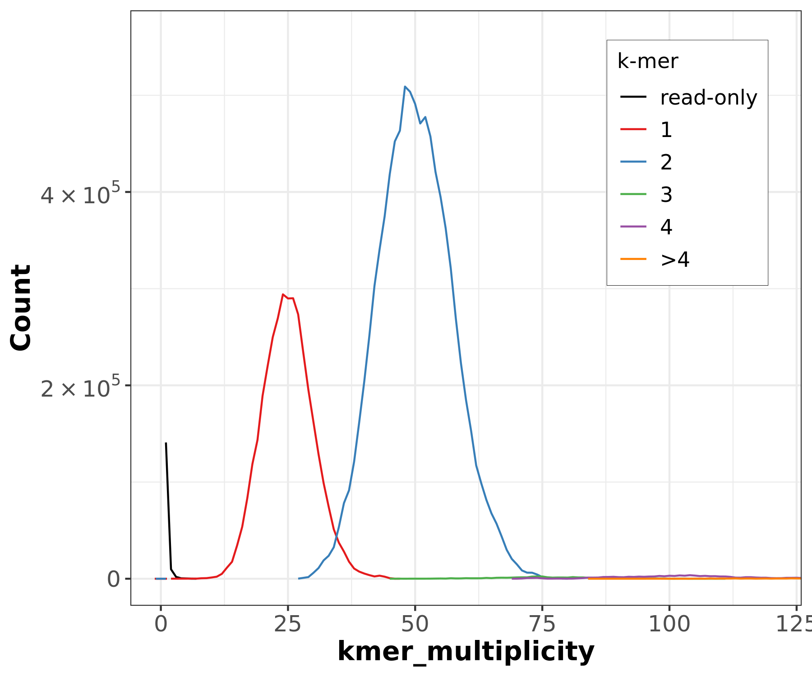
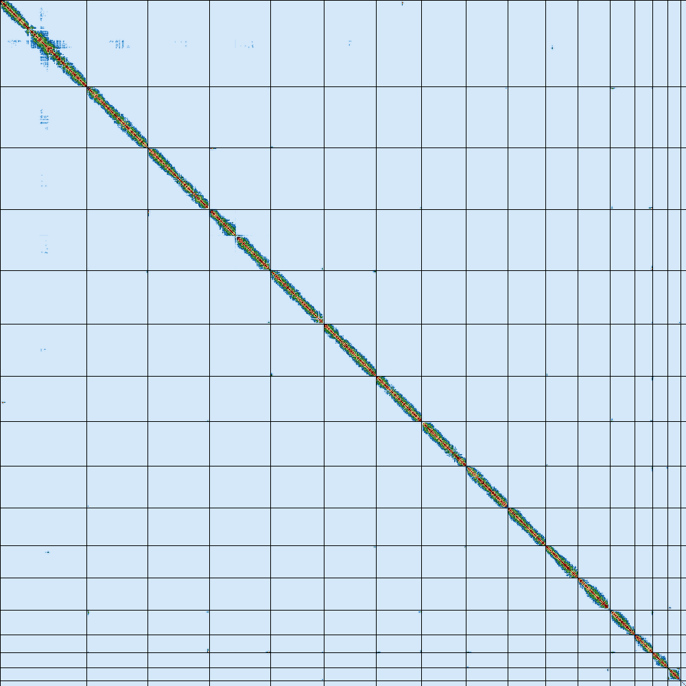
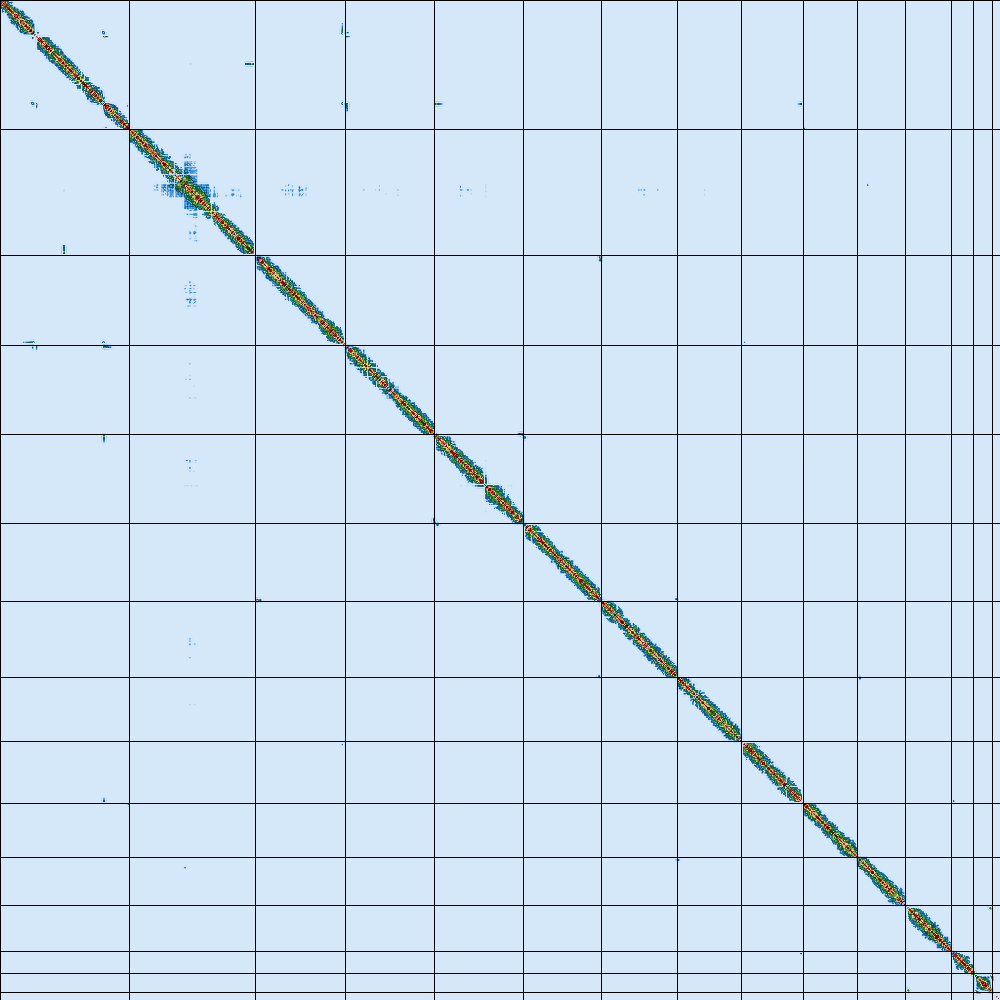

# 🧬 VGP-HiFi-HiC-Assembly-Pipeline

> Steps to assemble a high-quality genome using the VGP assembly pipeline, including multiple Quality Control (QC) evaluations.

---

## 📚 Table of Contents

- [Pipeline Overview](#-pipeline-overview)
- [Pipeline Workflow](#-pipeline-workflow)
- [Detailed Step Breakdown](#-detailed-step-breakdown)
- [Key Quality Metrics](#-key-quality-metrics)
- [Tools Used](#-tools-used)
- [Results](#-results)
  - [Genome Profiling — GenomeScope2](#-genome-profiling--genomescope2)
  - [Gene Completeness — BUSCO](#-gene-completeness--busco)
  - [K-mer Quality — Merqury](#-k-mer-quality--merqury)
  - [Hi-C Contact Map](#-hi-c-contact-map)
- [Notes](#-notes)

---

## 🔬 Pipeline Overview

This pipeline follows the **Vertebrate Genomes Project (VGP)** assembly workflow in **Hi-C Phased Mode**. Starting from raw PacBio HiFi and Illumina Hi-C reads, the pipeline produces two high-quality, haplotype-resolved genome assemblies through preprocessing, assembly, quality control, and scaffolding stages.

---

## 🗺️ Pipeline Workflow

```
================================================================================
              VGP GENOME ASSEMBLY PIPELINE — Hi-C PHASED MODE
================================================================================

                       ┌─────────────────────────┐
                       │  Upload Data to Galaxy   │
                       └───────────┬─────────────┘
                                   │
                                   ▼
                       ┌─────────────────────────┐
                       │       INPUT DATA         │
                       │ ─────────────────────── │
                       │  3 HiFi files +          │
                       │  2 Hi-C files            │
                       └───────────┬─────────────┘
                                   │
                                   ▼
                       ┌─────────────────────────┐
                       │  Organize Collections    │
                       │ ─────────────────────── │
                       │  Create HiFi collection  │
                       └───────────┬─────────────┘
                                   │
                                   ▼
                       ┌─────────────────────────┐
                       │        Cutadapt          │
                       │ ─────────────────────── │
                       │  Remove adapter          │
                       │  sequences               │
                       └───────────┬─────────────┘
                                   │
                                   ▼
                       ┌─────────────────────────┐
                       │          Meryl           │
                       │ ─────────────────────── │
                       │  K-mer counting (k=31)   │
                       └───────────┬─────────────┘
                                   │
                                   ▼
                       ┌─────────────────────────┐
                       │      GenomeScope2        │
                       │ ─────────────────────── │
                       │  Genome size estimation  │
                       └───────────┬─────────────┘
                                   │
                                   ▼
                       ┌─────────────────────────┐
                       │   Hifiasm Hi-C Mode      │
                       │ ─────────────────────── │
                       │  Generate Hap1 + Hap2    │
                       └───────────┬─────────────┘
                                   │
                                   ▼
                       ┌─────────────────────────┐
                       │        gfastats          │
                       │ ─────────────────────── │
                       │  Convert GFA to FASTA    │
                       └───────────┬─────────────┘
                                   │
                                   ▼
                       ┌─────────────────────────┐
                       │    gfastats Stats        │
                       │ ─────────────────────── │
                       │  N50, contigs, length    │
                       └───────────┬─────────────┘
                                   │
                                   ▼
                       ┌─────────────────────────┐
                       │          BUSCO           │
                       │ ─────────────────────── │
                       │  Genome completeness     │
                       └───────────┬─────────────┘
                                   │
                                   ▼
                       ┌─────────────────────────┐
                       │         Merqury          │
                       │ ─────────────────────── │
                       │  K-mer based QC          │
                       └───────────┬─────────────┘
                                   │
                                   ▼
                       ┌─────────────────────────┐
                       │      FINAL ASSEMBLY      │
                       │ ─────────────────────── │
                       │  Two haplotype-resolved  │
                       │  genomes                 │
                       └─────────────────────────┘

================================================================================
```

### Pipeline Stages at a Glance

| Color | Stage | Steps |
|-------|-------|-------|
| 🔵 Data & Preprocessing | Input → Organize → Cutadapt | 1–3 |
| 🟢 Genome Profiling & QC | Meryl → GenomeScope2 → gfastats → BUSCO → Merqury | 4–9 |
| 🟣 Assembly | Hifiasm → gfastats (GFA to FASTA) | 10–11 |
| 🟡 Final Output | Hap1 + Hap2 Final Assembly | 12 |

---

## 🔩 Detailed Step Breakdown

### Step 1 — Upload Data to Galaxy
Import all sequencing data into the Galaxy platform.

**Files Required:**
```
HiFi_synthetic_50x_01.fasta
HiFi_synthetic_50x_02.fasta
HiFi_synthetic_50x_03.fasta
SRR7126301_1.fastq.gz   (Hi-C forward)
SRR7126301_2.fastq.gz   (Hi-C reverse)
```

---

### Step 2 — Input Data
Organize uploaded files by data type:
- **HiFi reads** — PacBio HiFi sequencing at 50× coverage
- **Hi-C reads** — Illumina paired-end reads for phasing

---

### Step 3 — Organize Collections
Group the 3 HiFi FASTA files into a single Galaxy collection (`HiFi_collection`) for batch processing.

---

### Step 4 — Cutadapt `v4.4+galaxy0`
Remove adapter sequences from HiFi reads before assembly.

| Parameter | Value |
|-----------|-------|
| Adapter 1 | `ATCTCTCTCAACAACAACAACGGAGGAGGAGGAAAAGAGAGAGAT` |
| Adapter 2 | `ATCTCTCTCTTTTCCTCCTCCTCCGTTGTTGTTGTTGAGAGAGAT` |
| Output | HiFi_collection (trimmed) |

---

### Step 5 — Meryl
Generate a k-mer spectrum from trimmed HiFi reads for genome profiling.

| Parameter | Value |
|-----------|-------|
| K-mer size | 31 |
| Output | meryldb, histogram |

---

### Step 6 — GenomeScope2 `v2.0+galaxy2`
Estimate genome characteristics from the k-mer histogram.

| Parameter | Value |
|-----------|-------|
| Ploidy | 2 (diploid) |
| K-mer length | 31 |
| Output | Genome size, heterozygosity, coverage estimates |

---

### Step 7 — Hifiasm Hi-C Mode `v0.19.8+galaxy0`
Perform de novo diploid genome assembly using Hi-C phased mode.

| Input | Output |
|-------|--------|
| HiFi_collection (trimmed) | Hap1 contigs graph (.gfa) |
| Hi-C reads (forward + reverse) | Hap2 contigs graph (.gfa) |

---

### Step 8 — gfastats (Conversion) `v1.3.6+galaxy0`
Convert GFA format assembly graphs to FASTA format for downstream analysis.

- **Output:** Hap1 contigs FASTA, Hap2 contigs FASTA

---

### Step 9 — gfastats Stats `v1.3.6+galaxy0`
Calculate core assembly statistics for both haplotypes.

**Metrics reported:**
- Number of contigs
- Total assembly length
- N50 / NG50
- Largest contig
- GC content

---

### Step 10 — BUSCO `v5.5.0+galaxy0`
Assess genome completeness by searching for conserved genes.

| Parameter | Value |
|-----------|-------|
| Lineage | Saccharomycetes |
| Mode | Genome assemblies (DNA) |
| Metrics | Complete, Duplicated, Fragmented, Missing BUSCOs |

---

### Step 11 — Merqury `v1.3+galaxy3`
Evaluate assembly quality using k-mer copy number analysis without a reference genome.

| Input | Output |
|-------|--------|
| Merged meryldb | K-mer spectra plots |
| Hap1 + Hap2 assemblies | QV statistics, Completeness metrics |

---

### Step 12 — Final Assembly
Two high-quality, haplotype-resolved genome assemblies.

| Metric | Expected Value |
|--------|----------------|
| Hap1 size | ~11–12 Mbp |
| Hap2 size | ~11–12 Mbp |
| BUSCO completeness | > 95% |
| Duplication rate | < 5% |

---

## 📊 Key Quality Metrics

| Metric | Value |
|--------|-------|
| Genome Size | ~11.7 Mbp (from GenomeScope2) |
| Heterozygosity | ~0.576% |
| Coverage | 50× (HiFi) |
| Expected Contigs | < 20 per haplotype |
| N50 Target | > 500 Kbp |
| BUSCO Completeness | > 95% |
| Duplication Rate | < 5% |

---

## 🛠️ Tools Used

| Tool | Version | Purpose |
|------|---------|---------|
| [Cutadapt](https://cutadapt.readthedocs.io/) | 5.2+galaxy2 | Adapter trimming |
| [Meryl](https://github.com/marbl/meryl) | 1.3+galaxy6 | K-mer counting |
| [GenomeScope2](https://github.com/tbenavi1/genomescope2.0) | 2.0+galaxy2 | Genome profiling |
| [Hifiasm](https://github.com/chhylp123/hifiasm) | 0.19.8+galaxy0 | De novo assembly |
| [Gfastats](https://github.com/vgl-hub/gfastats) | 1.3.6+galaxy0 | Assembly stats |
| [BUSCO](https://busco.ezlab.org/) | 5.5.0+galaxy0 | Gene completeness |
| [Merqury](https://github.com/marbl/merqury) | 1.3+galaxy3 | K-mer quality |
| [Bionano Hybrid Scaffold](https://bionano.com/) | 3.7.0+galaxy3 | Optical map scaffolding |
| [BWA-MEM](https://github.com/lh3/bwa) | 2.2.1+galaxy1 | Hi-C read mapping |
| [Filter and Merge](https://github.com/ArimaGenomics/mapping_pipeline) | 1.0+galaxy1 | Chimeric read filtering |
| [PretextMap](https://github.com/wtsi-hpag/PretextMap) | 0.1.9+galaxy0 | Contact map generation |
| [Pretext Snapshot](https://github.com/wtsi-hpag/PretextSnapshot) | 0.0.3+galaxy1 | Contact map image |
| [YaHS](https://github.com/c-zhou/yahs) | 1.2a.2+galaxy1 | Hi-C scaffolding |

---

## 📈 Results

### 🔭 Genome Profiling — GenomeScope2

Genome profiling is based on the analysis of k-mer frequencies. It provides information about genomic complexity — including genome size, levels of heterozygosity and repeat content — as well as data quality.


> **Figure:** GenomeScope2 31-mer profile. The first peak at coverage 25× corresponds to the heterozygous peak. The second peak at 50× corresponds to the homozygous peak. Estimated heterozygosity is 0.576%. The plot also reports inferred genome length (`len`), unique length percent (`uniq`), overall heterozygosity rate (`ab`), mean k-mer coverage for heterozygous bases (`kcov`), read error rate (`err`), average rate of read duplications (`dup`), k-mer size (`k`), and ploidy (`p`).

**GenomeScope2 Statistics:**

| Property | Min | Max |
|----------|-----|-----|
| Homozygous (aa) | 99.4165% | 99.4241% |
| Heterozygous (ab) | 0.575891% | 0.583546% |
| Genome Haploid Length | 11,739,513 bp | 11,747,352 bp |
| Genome Unique Length | 11,016,399 bp | 11,023,756 bp |
| Model Fit | 92.5159% | 96.5191% |
| Read Error Rate | 0.000943190% | 0.000943190% |

---

### ✅ Gene Completeness — BUSCO

BUSCO provides a qualitative assessment of genome assembly completeness in terms of expected gene content. It relies on analysis of genes that should be present only once in a complete assembly, while allowing for rare gene duplications or losses.

**Haplotype 1**


| Statistic | Value |
|-----------|-------|
| Number of scaffolds | 17 |
| Number of contigs | 17 |
| Total length | 12,160,908 bp |
| Percent gaps | 0.000% |
| Scaffold N50 | 922 KB |
| Contig N50 | 922 KB |

**Haplotype 2**


| Statistic | Value |
|-----------|-------|
| Number of scaffolds | 16 |
| Number of contigs | 16 |
| Total length | 11,304,584 bp |
| Percent gaps | 0.000% |
| Scaffold N50 | 923 KB |
| Contig N50 | 923 KB |

---

### 🔢 K-mer Quality — Merqury

Merqury provides a complementary, reference-free approach for assessing genome assembly quality via k-mer copy number analysis.



> **Figure:** Merqury CN plot. This plot tracks the multiplicity of each k-mer found in the HiFi read set and colors it by the number of times it is found in a given assembly. Merqury connects the midpoint of each histogram bin with a line, giving the appearance of a smooth curve.

---

### 🗺️ Hi-C Contact Map

Hi-C contact maps show genomic regions that physically interact in the cell nucleus. Regions on the same chromosome interact far more than regions on different chromosomes.

**Before YaHS Scaffolding**



> **Figure:** Hi-C map representative of a typical misassembly prior to scaffolding.

**After YaHS Scaffolding**



> **Figure:** After YaHS, the contact map shows 16–17 clear triangular blocks — each block representing one *S. cerevisiae* chromosome. This confirms successful chromosome-level assembly.

---

## 📝 Notes

- Hi-C phased mode produces cleaner assemblies than solo mode
- Purging step is usually **not** needed with Hi-C phasing
- Both haplotypes (Hap1 and Hap2) should be similar in size
- Low BUSCO duplication indicates good phasing quality
- This tutorial uses yeast (*S. cerevisiae*) as the example organism

---

*Pipeline implemented on [Galaxy](https://usegalaxy.org/) following the [VGP Assembly workflow](https://training.galaxyproject.org/).*
